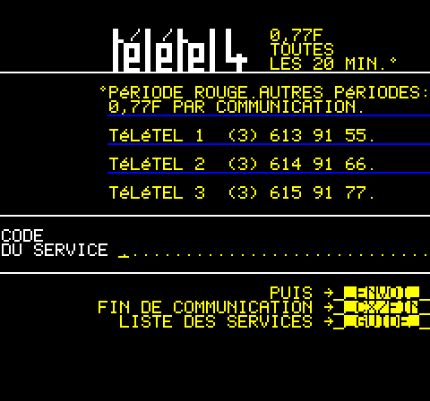
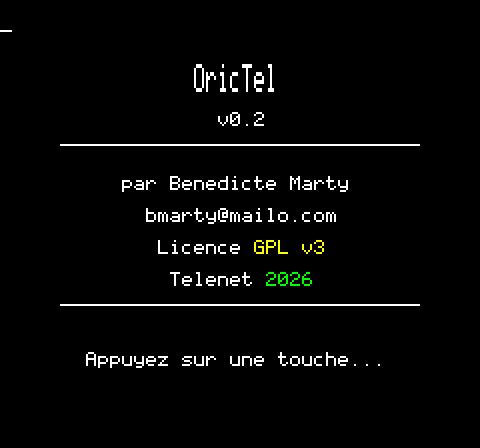

# OricTel - Emulateur Minitel 1B pour Oric 1/Atmos

**Version:** 0.2.33
**Date:** 2026-06-13
**Auteur:** bmarty <bmarty@mailo.com>
**Depot public:** https://github.com/benedictemarty/orictel

## Description

OricTel transforme votre Oric 1 ou Oric Atmos en terminal Minitel 1B complet,
capable de se connecter aux serveurs Minitel encore en activite sur Internet
(PAVI 3617, MiniPavi, ...).

| Accueil Teletel (PAVI 3617) | Ecran de demarrage |
|:---:|:---:|
|  |  |

Trois modes de connexion :

1. **Modem AT** (recommande) : le backend modem de Phosphoric emule un modem
   Hayes ; OricTel compose le serveur choisi au menu via ATD host:port.
2. **TCP direct V23** : connexion TCP directe vers un serveur fixe.
3. **WebSocket** : relais Python asyncio entre l'emulateur et un serveur
   Minitel WebSocket (ws://3617.fr/ws).

Voir le **[Manuel d'utilisation](docs/MANUEL_UTILISATION.md)** pour le guide
complet cote utilisateur.

## Architecture

```
Serveur Minitel (ex: pavi.3617.fr:3617)
         |
         | TCP (modem AT / direct)        ou     WebSocket (ws://3617.fr/ws)
         |                                            |
         v                                   [orictel_bridge.py]
   [Phosphoric]                                       |
  ACIA 6551 @ $031C                           TCP :3615
         |                                            |
         +--------------------------------------------+
         |
         v
  [Programme OricTel sur Oric]
    +-- serial_asm.s   (driver ACIA 6551, polling)
    +-- serial_tx.c    (file d'emission non bloquante)
    +-- videotex.c     (decodeur protocole Videotex)
    +-- display.c      (rendu HIRES, heuristique couleur)
    +-- display_asm.s  (moteur de rendu cellules 6502)
    +-- keyboard.c     (clavier + mapping Minitel)
    +-- fonts.c        (G0, G1, G2)
    +-- main.c         (boucle principale, menus, modem AT)
```

### Composants

1. **Programme Oric** (`orictel.tap`) - Terminal Minitel en 6502 (C + ASM via cc65)
   - Decodeur protocole Videotex complet (Teletel/Antiope)
   - Machine a etats : ESC, CSI (avec parametres), US, SS2, REP, SEP, PRO1/2/3
   - Rendu HIRES 40x25 : moteur de plage en assembleur (~300 cycles/cellule),
     dirty par plage de colonnes, budget adaptatif (clavier toujours reactif)
   - Heuristique couleur hybride : attributs serial poses sur les cellules
     vides avec regard-avant (couleur du texte qui suit), mosaiques en couleur
     solide quand l'attribut correspond, dithering par luminance en repli
   - Jeux de caracteres G0 (alphanum + accents), G1 (mosaiques 2x3, cache
     precalcule), G2 (CEPT etendu, accents precomposes min/maj)
   - Attributs complets : couleurs, flash, inversion, soulignement, masque
     global, mosaique separee, double hauteur/largeur/taille
   - Modes PRO2/PRO3 : rouleau, minuscules, aiguillages appliques au clavier,
     clavier etendu/curseur
   - 3 modes de rendu commutables (CTRL+D) : auto, dithering, brut
   - Splash screen avec jingle AY-3-8912
   - Menu de connexion (modem AT / direct) et de serveur (predefinis + saisie)

2. **Bridge WebSocket-TCP** (`orictel_bridge.py`) - Proxy Python asyncio
   - Ecoute TCP sur port 3615 (emulateur), connexion WebSocket vers 3617.fr
   - Relais bidirectionnel transparent, mono-client, statistiques, mode -v

## Pre-requis

- **cc65** (cross-compilateur 6502) >= 2.19
- **Python 3.8+** avec module `websockets` >= 12.0 (pour le bridge uniquement)
- **Emulateur Phosphoric** (backend modem, TCP ou Digitelec)
- ROMs Oric (basic11b.rom pour Atmos, basic10.rom pour Oric-1)

## Compilation et tests

```bash
make                # Compile orictel.tap
make test           # Tests decodeur Videotex (host gcc) + bridge
make test-server    # Serveur Videotex local de demo (test manuel)
make clean          # Nettoyage
```

## Utilisation

### Mode modem AT (recommande, serveur choisi dans le menu)

```bash
make run
# Equivalent a:
# oric1-emu --rom basic11b.rom --tape orictel.tap -f \
#     --serial modem --serial-buffer 4096
```

### Mode TCP direct V23 (serveur fixe, sans bridge)

```bash
make run-direct
# Equivalent a:
# oric1-emu --rom basic11b.rom --tape orictel.tap -f \
#     --serial tcp:pavi.3617.fr:3617 --serial-v23 --serial-buffer 4096
```

### Mode WebSocket (avec bridge)

```bash
make run-ws         # lance bridge + emulateur, et arrete le bridge en sortant
# Bridge seul: make bridge
# Ou: python3 bridge/orictel_bridge.py [--tcp-port 3615] [--ws-url ws://3617.fr/ws] [-v]
```

### Serveurs Minitel proposes au menu

- `pavi.3617.fr:3617` - PAVI 3617 (recommande)
- `go.minipavi.fr:516` - MiniPavi
- Saisie libre pour tout autre serveur (hostname:port)

## Touches Minitel

Compatible Oric-1 (pas de touche FUNCT) et Atmos.
Methode principale: **CTRL+lettre** (fonctionne sur les deux machines).

| Fonction Minitel  | Oric-1 & Atmos    | Atmos seul  | Codes envoyes  |
|-------------------|-------------------|-------------|----------------|
| Envoi             | RETURN            |             | SEP $41        |
| Retour            | CTRL+R ou Fl.HAUT | FUNCT+R     | SEP $42        |
| Repetition        | CTRL+E            | FUNCT+E     | SEP $43        |
| Guide             | CTRL+G            | FUNCT+G     | SEP $44        |
| Annulation        | CTRL+A ou ESC     | FUNCT+A     | SEP $45        |
| Sommaire          | CTRL+S            | FUNCT+S     | SEP $46        |
| Correction        | DELETE            |             | SEP $47        |
| Suite (page suiv) | CTRL+N            | FUNCT+N     | SEP $48        |
| Connexion/Fin     | CTRL+C            | FUNCT+C     | SEP $49        |
| Fleches G/D       | Fl.GAUCHE/DROITE  |             | ESC[D / ESC[C (mode curseur PRO3) |
| Mode rendu        | CTRL+D            |             | (local)        |
| Effacer ecran     | CTRL+L            |             | (local)        |
| Reset ACIA        | CTRL+F            |             | (local)        |

## Specifications techniques

- **Affichage:** HIRES 240x200, 40x25 caracteres (6x8 pixels/car),
  inversion video par bit 7, attributs serial Oric par scanline
- **Serie:** ACIA 6551, Control=$00 (transfert instantane sous emulateur);
  le V23 reel (1200/75, 7E1) est prevu en ROADMAP
- **Emission:** file TX logicielle non bloquante drainee par la boucle
  principale (prerequis vrai materiel V23)
- **Memoire:** TAP ~23 Ko, code+donnees sous $9800 (stack cc65 $0800),
  framebuffer HIRES $A000-$BF3F
- **Protocole:** Videotex Teletel/Antiope (STUM 1B); l'identification
  ENQ/ENQROM est volontairement muette (alignement miedit: les serveurs
  modernes echoient la reponse dans le champ de saisie)
- **Performance:** page complete ~0,3 s, echo de frappe ~1 ms (rendu de la
  cellule seule)
- **Reference:** emulateur JS miedit/telenet pour la validite du protocole

## Documentation

- `docs/MANUEL_UTILISATION.md` - Manuel d'utilisation complet
- `docs/ARCHITECTURE.md` - Architecture technique detaillee
- `docs/AGILE_PLAN.md` - Plan agile et suivi des sprints
- `ROADMAP` - Vision et planification des versions
- `CHANGELOG` - Historique des modifications
- `VERSION_TRACKING` - Suivi des versions par composant
- `CIRRUS_OS` - Statut de build et plateforme cible

## Licence

EUPL 1.2 (European Union Public Licence) - Voir fichier LICENSE
